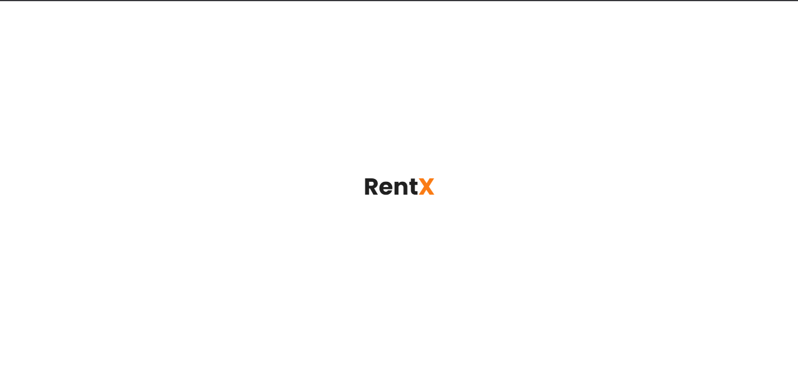
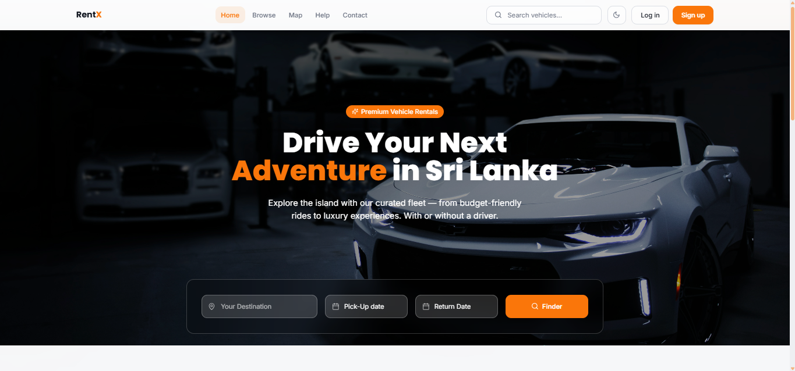
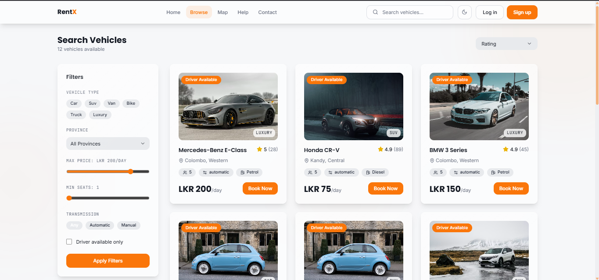
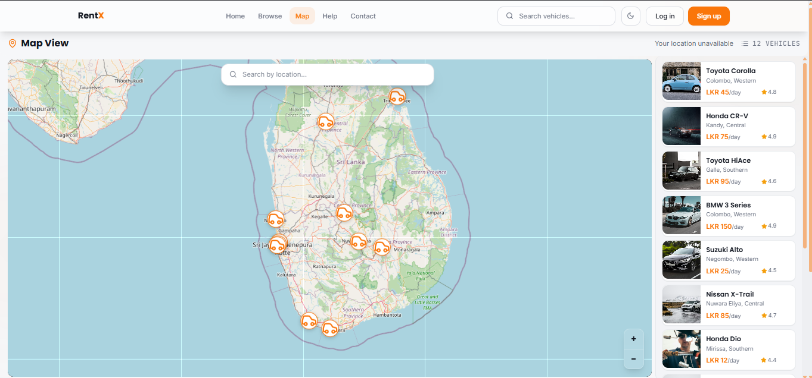
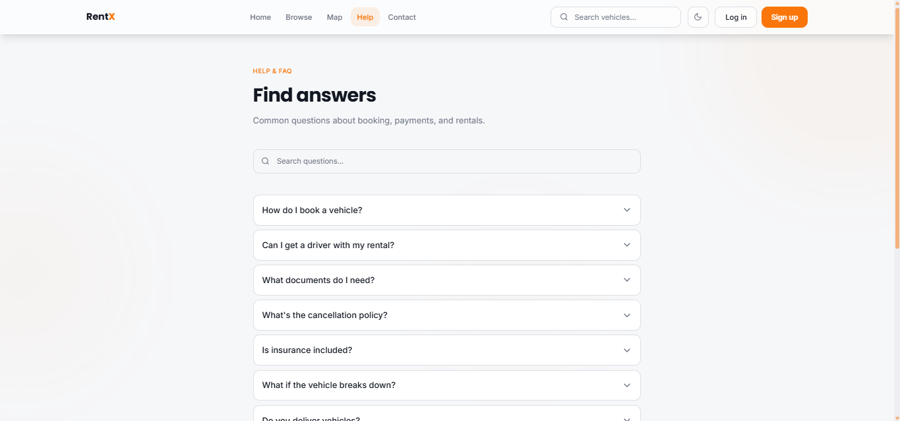
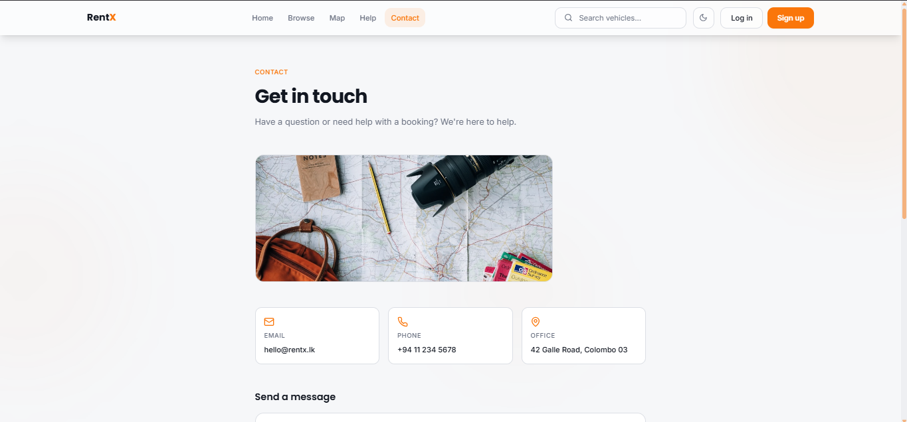
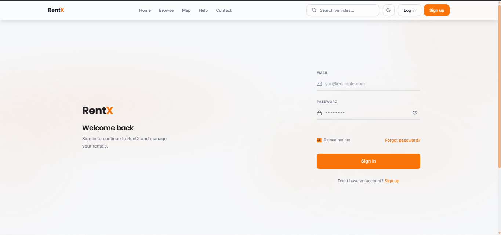
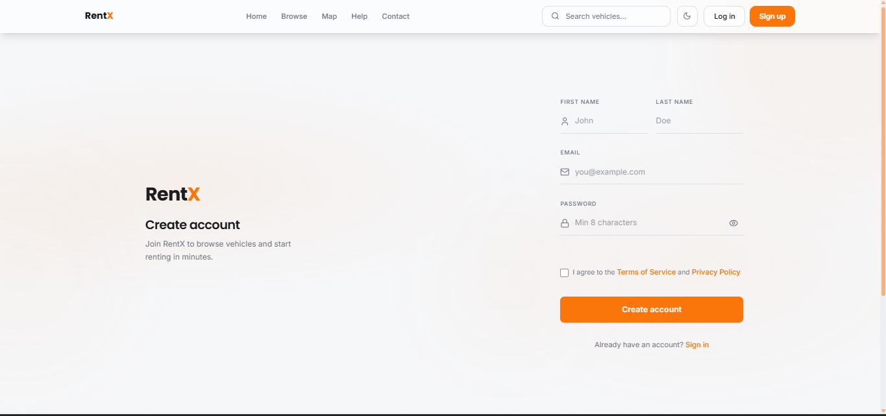
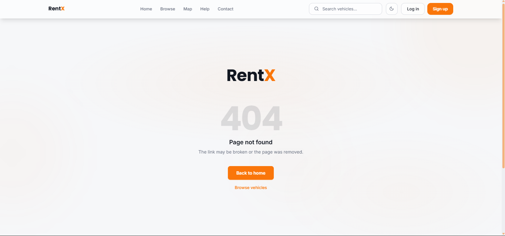
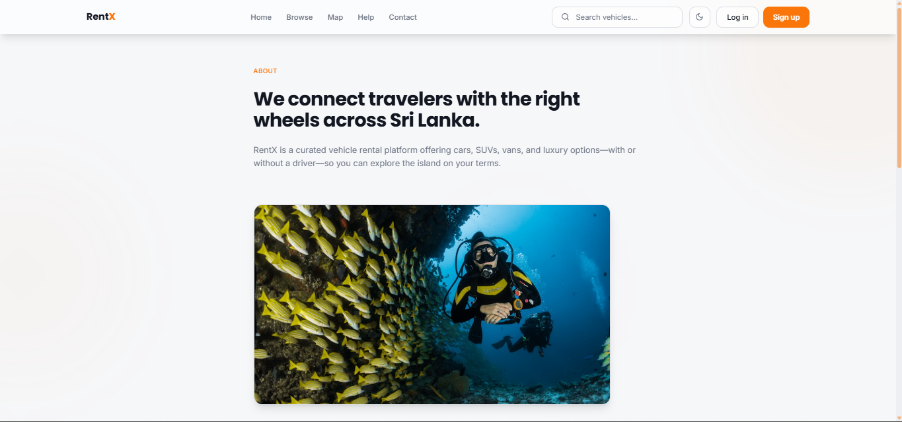

<div align="center">

<h1><strong>Rent<span style="color:#f97316">X</span></strong></h1>

### Premium vehicle rentals — browse, search & book

[](https://react.dev/)
[](https://www.typescriptlang.org/)
[](https://vitejs.dev/)
[](https://tailwindcss.com/)
[](https://supabase.com/)

</div>

---

## ✨ Features

| Feature | Description |
|--------|-------------|
| 🗺️ **Interactive map** | Browse vehicles on a Leaflet map with filters |
| 🔍 **Search & filters** | Find cars, SUVs, bikes by type, price, and location |
| 🚗 **Vehicle details** | Rich detail pages with specs, gallery, and quick view |
| 🔐 **Auth flows** | Minimal sign-in & sign-up with password strength and show/hide |
| 🌙 **Dark mode** | System-aware theme with smooth transitions |
| 📱 **Responsive** | Layouts tuned for mobile, tablet, and desktop |
| ⚡ **Fast** | Vite + React 18 for quick dev and optimized builds |

---

## 📸 Screenshots

<p align="center">
  
  
</p>
<p align="center">
  
  
</p>
<p align="center">
  
  
</p>
<p align="center">
  
  
</p>
<p align="center">
  
  
</p>

---

## 🛠 Tech stack

### Languages & core

| Badge | Tech |
|-------|------|
|  | **React 18** — UI library |
|  | **TypeScript** — type-safe JavaScript |
|  | **HTML5** |
|  | **CSS3** — Tailwind + custom |

### Build & tooling

| Badge | Tech |
|-------|------|
|  | **Vite** — build tool & dev server |
|  | **ESLint** — linting |
|  | **Vitest** — unit tests |

### UI & styling

| Badge | Tech |
|-------|------|
|  | **Tailwind CSS** — utility-first CSS |
|  | **Radix UI** — accessible primitives (shadcn) |
|  | **Framer Motion** — animations |
|  | **Lucide React** — icons |

### Data & backend

| Badge | Tech |
|-------|------|
|  | **Supabase** — auth, database & realtime |
|  | **TanStack Query** — server state & caching |

### Libraries

| Badge | Tech |
|-------|------|
|  | **React Router** — routing |
|  | **Leaflet** + **React Leaflet** — maps |
|  | **Zod** — schema validation |
|  | **React Hook Form** — forms |
|  | **Recharts** — charts |
|  | **date-fns** — dates |

---

## 📁 Project structure

```
RentX/
├── public/
├── screenshots/   # s1.png … s10.png (for README)
├── src/
│   ├── components/     # Reusable UI (Layout, Navbar, Footer, VehicleCard, etc.)
│   ├── components/ui/  # shadcn/ui primitives
│   ├── data/           # Static data (vehicles, map locations)
│   ├── hooks/          # useTheme, useToast, useMobile
│   ├── lib/            # utils
│   ├── pages/          # Route pages (Index, Search, Map, Login, Signup, 404, etc.)
│   ├── App.tsx
│   ├── main.tsx
│   └── index.css
├── index.html
├── package.json
├── tailwind.config.ts
├── tsconfig.json
└── vite.config.ts
```

---

## 🚀 Getting started

### Prerequisites

- **Node.js** 18+  
- **npm** or **yarn** or **pnpm**

### Install & run

```bash
# Clone the repo (if needed)
git clone <your-repo-url>
cd RentX

# Install dependencies
npm install

# Start dev server
npm run dev
```

Open [http://localhost:5173](http://localhost:5173) in your browser.

### Build for production

```bash
npm run build
npm run preview   # Preview production build locally
```

### Other scripts

| Command | Description |
|---------|-------------|
| `npm run dev` | Start Vite dev server |
| `npm run build` | Production build |
| `npm run preview` | Serve production build |
| `npm run lint` | Run ESLint |
| `npm run test` | Run Vitest once |
| `npm run test:watch` | Run Vitest in watch mode |

---

## 🔗 Supabase (backend)

RentX is built to work with **Supabase** for:

- **Authentication** — sign up, sign in, sessions  
- **Database** — vehicles, bookings, user profiles  
- **Realtime** — live updates (e.g. availability)  
- **Storage** — vehicle images and documents  

Add your Supabase project URL and anon key in environment variables when you connect the backend.

---

## 📄 License

Private — All rights reserved.

---

<div align="center">

**Rent<span style="color:#f97316">X</span>** — *Premium vehicle rentals*

</div>
